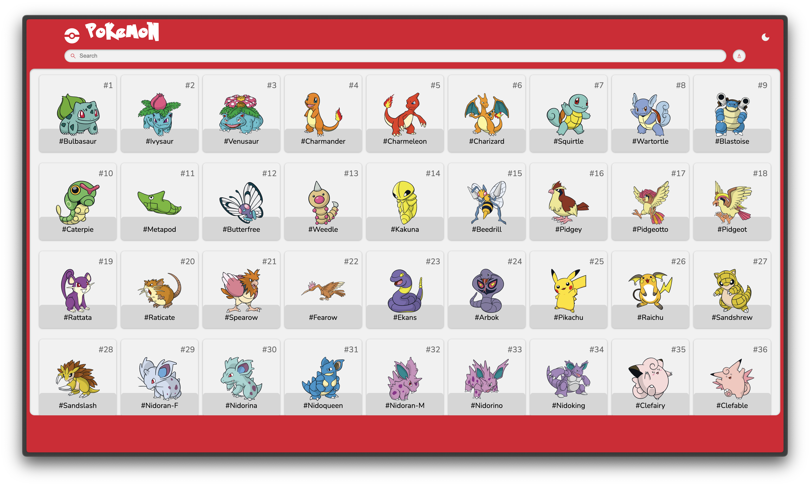
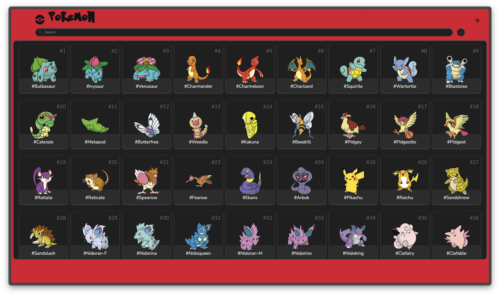
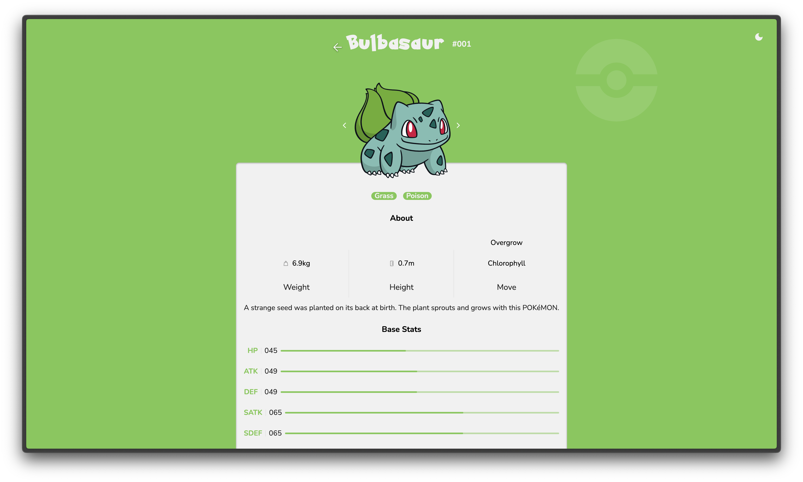
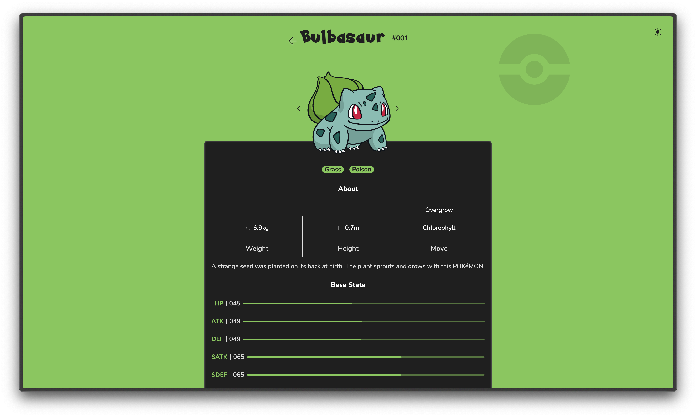

# Pokedex
Pokedex web-app using the PokeAPI.

Some days ago, I made a project named "Who's That Pokemon" (You can check it out on my github, link: https://github.com/Pari55051/whos-that-pokemon ). From which I found out about many new Pokemons. This made me curious about exploring Pokemons, thus I made it to learn about more Pokemons.

## All Pokemons Preview

## Pokemon Details Page Preview

## Features
- Dark/Light mode
- Search Pokemon by - 
    - All
    - Numbers
    - Name
- Pokemon details page -
    - image of Pokemon
    - element of Pokemon
    - Weight, Height and Moves of Pokemon
    - Base stats

## Learning/Challenges
- Learned more about using API
- Deciding on colors theme for dark/light mode

## Credits
- made by: [unowen](https://github.com/pari55051)
- API: [PokeAPI](https://pokeapi.co)
- fonts: [Pokemon Font - DaFont](https://www.dafont.com/pokemon.font), [Nunito](https://fonts.google.com/specimen/Nunito)
